# MiniPrice 🛒 – Kotlin Android Supermarket App

**MiniPrice** is a modern Android app developed in Kotlin that allows users to shop for groceries in an easy and organized way. It includes user authentication, a shopping cart system, order history, admin panel, and integration with Firebase for real-time data management.

## 🚀 Features

### For Regular Users:
- View products by categories
- Add items to the shopping cart with adjustable quantity (+/– or manually)
- Checkout with full address input
- Save orders to Firebase
- View order history and filter by status (In Progress, Delivered, etc.)
- Cancel or edit orders (only if still in preparation)
- Restore a previous order (including cart and address)
- Request a new product with optional image upload

### For Admin:
- Log in as `AdminMiniPrice` to access the admin dashboard
- View all orders from all users
- Filter orders by status (In Progress, Out for Delivery, Delivered, Canceled)
- Change order status via dropdown menu
- View and delete customer product requests

## 🛠️ Built With

- **Kotlin + Android SDK** – Core Android development with Kotlin.
- **Firebase Firestore** – Cloud NoSQL database for storing and syncing orders, users, and product requests in real time.
- **Firebase Storage** – Cloud storage for uploading and storing images, such as product images or customer requests.
- **Glide** – Efficient image loading and caching library used to display product images from resources or Firebase Storage.
- **RecyclerView + CardView UI** – For displaying product lists, categories, and orders in a scrollable and optimized way.
- **ConstraintLayout** – Flexible UI layout system for building responsive and adaptable screens.
- **Material Components** – Modern UI components following the Material Design guidelines (buttons, text fields, menus, etc.).
- **SharedPreferences** – Local storage for saving temporary user data (e.g., logged-in username).
- **Intents + Bundles** – Navigation between activities and passing data.
- **Custom layouts and styles** – Tailored UI elements and consistent design.


## 👤 Admin Account

> You can register as a regular user from the login screen.

## 📽️ Demo Video

[▶️ Watch the MiniPrice demo on YouTube](https://youtu.be/3rf9cbh18do)

## 📸 App Screenshots

_The screenshots are stored under `app/screenshots/` in the project._

### 🔐 Login Screen
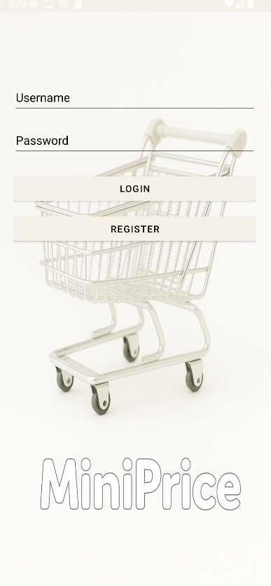

### 📋 Main Menu
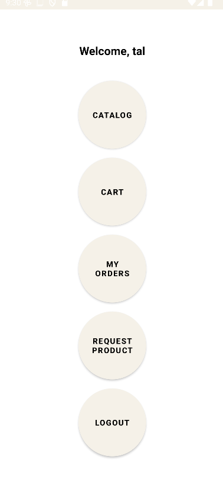

### 🗂️ Product Categories
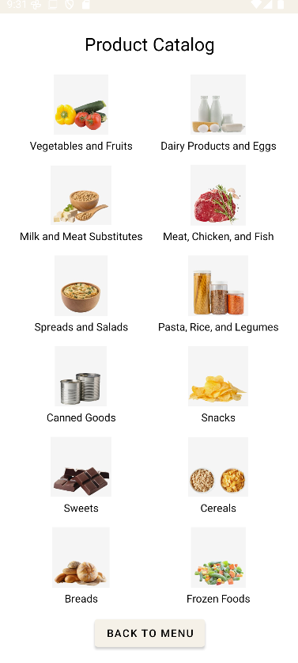

### 🛒 Cart View
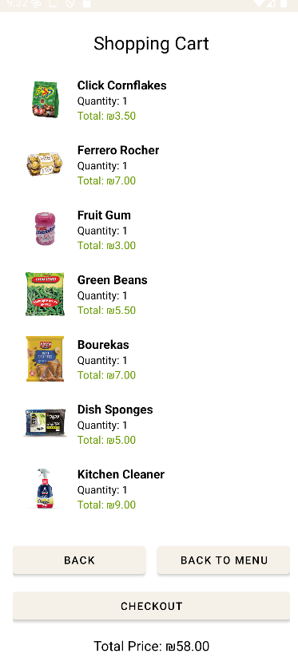

### 📦 Product Screen Example
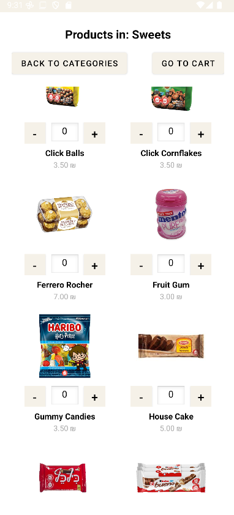

### 🏁 Checkout – Address Entry
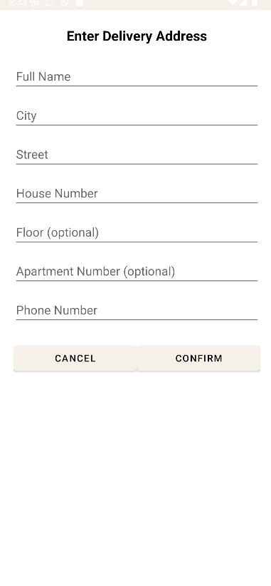

### 📄 Order Details
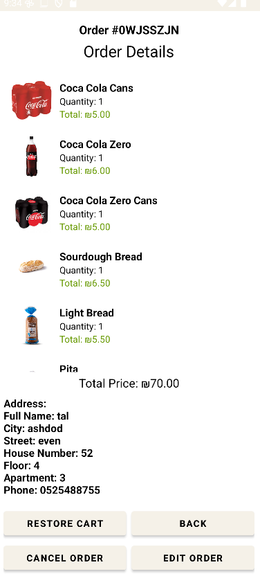

### 📑 Order Status Filtering
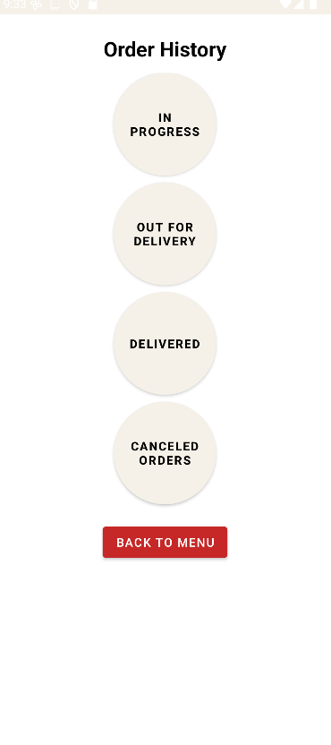

### 🙋 Request Product Screen
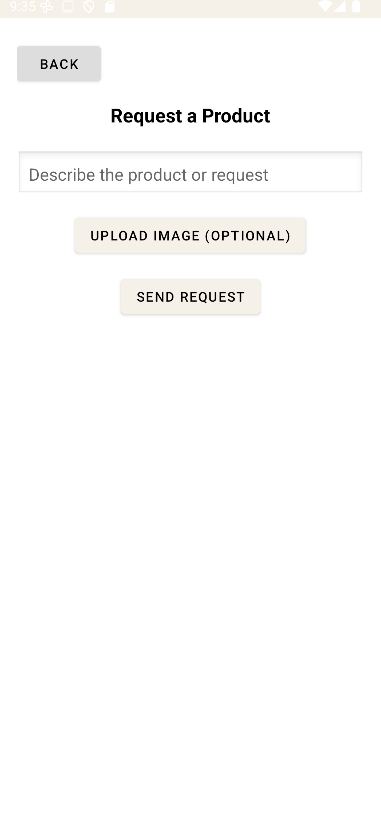

### 👩‍💼 Admin – Dashboard
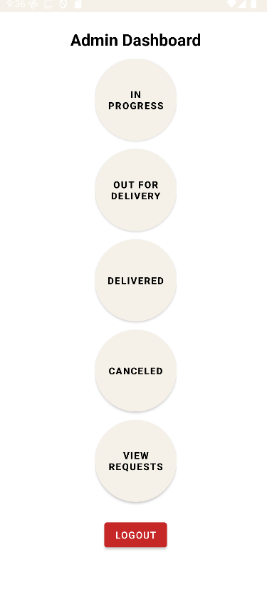

### 📥 Admin – Orders View
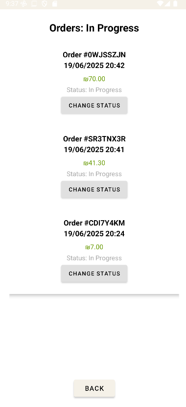

### 📬 Admin – Customer Requests
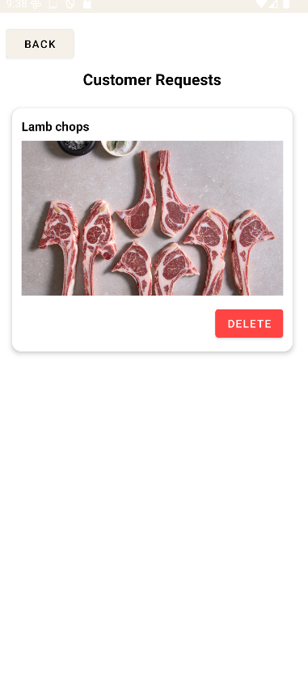

### 🛠️ Admin – Actions Message
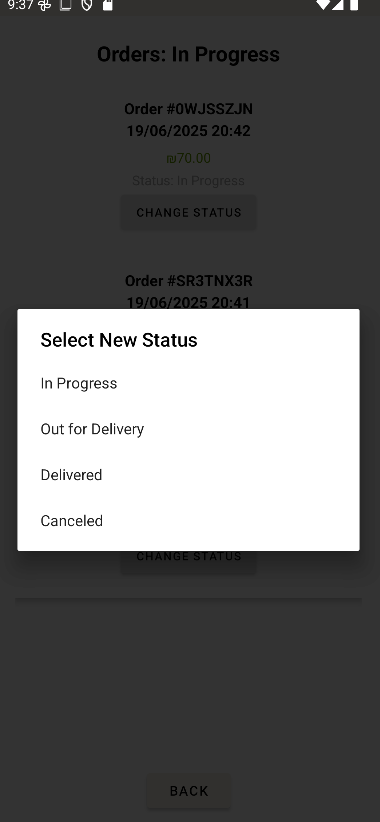

## 📦 How to Run the App

1. Clone the repository:
   ```bash
   git clone https://github.com/Tal-Jorno/MiniPrice---Kotlin-app.git
   ```

2. Open the project in Android Studio.

3. Make sure to add your `google-services.json` file from Firebase to the `app/` directory.

4. Sync Gradle and run the app on an emulator or real device.

## 📁 Project Structure (simplified)

```
📦 MiniPrice
 ┣ 📂 activities/
 ┣ 📂 adapters/
 ┣ 📂 models/
 ┣ 📂 utils/
 ┣ 📜 MainActivity.kt
 ┣ 📜 CartActivity.kt
 ┣ 📜 OrdersHistoryActivity.kt
 ┣ 📜 AdminDashboardActivity.kt
 ┗ ...
```

## ✅ Test Coverage

- Cart calculation logic
- Order filtering and status updates
- Address restoration
- Admin/user separation logic

## 📜 License

This project is for academic purposes only. All rights reserved © 2025 by Tal Jorno.
